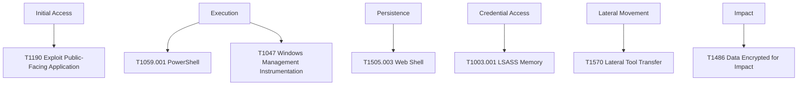
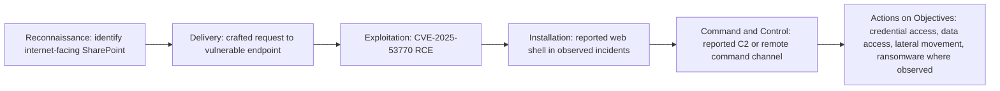

# Threat Intelligence Report: CVE-2025-53770

| Field | Value |
| --- | --- |
| Project | Project 02 - Threat Intelligence Report |
| Report type | Portfolio Demonstration based on public information |
| Version | v1.0 |
| Date | 2026-07-02 |
| Author | Juan Martinez |
| CVE analyzed | CVE-2025-53770 |

## Portfolio Demonstration Notice

This project is a Portfolio Demonstration. It is a synthetic case study created for a cybersecurity consulting portfolio. It does not represent paid client work, employment history, or testing performed for a real organization unless explicitly stated.

This report is based only on publicly available information about CVE-2025-53770. No live third-party systems were tested. No real client names, production IP addresses, credentials, proprietary data, or sensitive information are included.

## Revision History

| Version | Date | Changes |
| --- | --- | --- |
| v1.0 | 2026-07-02 | Initial published portfolio version |

## 1. Cover Page

**Report title:** Threat Intelligence Report: CVE-2025-53770  
**Vulnerability:** Microsoft SharePoint Server Remote Code Execution Vulnerability  
**Primary source type:** Public vendor advisory, public government advisories, public vulnerability database entries, and public security research  
**Audience:** Executives, IT administrators, security analysts, vulnerability managers, and incident response teams  
**Portfolio purpose:** Demonstrate threat intelligence research, source evaluation, CVSS interpretation, MITRE ATT&CK mapping, and executive-ready risk communication.

## 2. Executive Summary

CVE-2025-53770 is a critical remote code execution vulnerability in on-premises Microsoft SharePoint Server caused by deserialization of untrusted data. NVD lists the vulnerability as published on 2025-07-19 with a Microsoft CNA CVSS v3.1 base score of 9.8 and vector `CVSS:3.1/AV:N/AC:L/PR:N/UI:N/S:U/C:H/I:H/A:H`.

This report was selected for the portfolio because the vulnerability meets all project requirements: it was published within the last 12 months as of 2026-07-02, has enterprise impact, has CVSS 8.0 or higher, is supported by public documentation, and received significant vendor, government, and security community attention.

Microsoft stated that active attacks targeted on-premises SharePoint Server customers and that SharePoint Online in Microsoft 365 was not impacted. Microsoft also released security updates for supported versions of SharePoint Server and recommended immediate patching, AMSI enablement, endpoint detection coverage, and ASP.NET machine key rotation.

Business risk is high because SharePoint often stores sensitive business documents, integrates with Microsoft collaboration workflows, and may be internet-facing in enterprise environments. Successful exploitation can create a direct path to server-level compromise and follow-on activity such as web shell deployment, credential access, lateral movement, and ransomware, where those activities are observed in a victim environment.

## 3. Executive Risk Rating

| Rating item | Assessment |
| --- | --- |
| Overall executive risk | Critical |
| CVSS v3.1 | 9.8 Critical |
| Exploitation status | Vendor-confirmed exploitation in the wild |
| Exposure concern | Internet-facing on-premises SharePoint servers |
| Business impact | Potential server compromise, data exposure, credential theft, lateral movement, and operational disruption |
| Immediate priority | Patch, validate exposure, hunt for compromise, rotate ASP.NET machine keys, and isolate unsupported or unpatched public-facing systems |

## 4. Vulnerability Overview

| Item | Detail |
| --- | --- |
| CVE | CVE-2025-53770 |
| Vulnerability name | Microsoft SharePoint Server Remote Code Execution Vulnerability |
| Weakness | CWE-502: Deserialization of Untrusted Data |
| Published date | 2025-07-19 according to NVD |
| Vendor | Microsoft |
| Product family | On-premises Microsoft SharePoint Server |
| Impact type | Remote code execution over a network |
| Authentication requirement | No privileges required according to the CVSS vector |
| User interaction | None according to the CVSS vector |
| Cloud impact | Microsoft stated SharePoint Online in Microsoft 365 is not impacted |

NVD describes CVE-2025-53770 as deserialization of untrusted data in on-premises Microsoft SharePoint Server that allows an unauthorized attacker to execute code over a network. This report does not reproduce exploit steps or proof-of-concept details.

## 5. Affected Products

Public Microsoft guidance identifies the affected supported product line as on-premises SharePoint Server. Microsoft's customer guidance listed security updates for:

| Product | Included in public guidance | Notes |
| --- | --- | --- |
| Microsoft SharePoint Server Subscription Edition | Yes | Supported on-premises SharePoint Server release |
| Microsoft SharePoint Server 2019 | Yes | Supported on-premises SharePoint Server release |
| Microsoft SharePoint Server 2016 | Yes | Supported on-premises SharePoint Server release |
| SharePoint Online in Microsoft 365 | No | Microsoft stated SharePoint Online is not impacted |

This portfolio report does not list unsupported or unverified product versions as affected products. CISA/NVD guidance separately warned organizations to disconnect public-facing SharePoint Server versions that reached end of life or end of service, including SharePoint Server 2013 and earlier.

## 6. Technical Analysis

CVE-2025-53770 is a deserialization of untrusted data vulnerability in on-premises Microsoft SharePoint Server. The CVSS vector indicates network attackability, low attack complexity, no required privileges, no user interaction, unchanged scope, and high confidentiality, integrity, and availability impact.

Microsoft's public security blog stated that comprehensive security updates addressed CVE-2025-53770 and that the issue was related to the previously disclosed CVE-2025-49704. The Canadian Centre for Cyber Security summarized Microsoft guidance by stating that CVE-2025-53770 was a patch bypass for CVE-2025-49704.

Confirmed facts from vendor and government sources:

- Microsoft confirmed active attacks targeting on-premises SharePoint Server customers.
- Microsoft stated SharePoint Online in Microsoft 365 is not impacted.
- Microsoft released security updates for supported versions and recommended immediate application.
- CISA added CVE-2025-53770 to the Known Exploited Vulnerabilities catalog on 2025-07-20.
- NVD lists a Microsoft CNA CVSS v3.1 score of 9.8 Critical.

Reported observations from public security research and government advisories:

- Public reporting associated exploitation activity with the "ToolShell" SharePoint vulnerability chain.
- Microsoft reported observed threat actor activity including web shell deployment, credential access, lateral movement, and ransomware deployment in some incidents.
- The Canadian Centre for Cyber Security published potential indicators of compromise shared by the security research community and recommended compromise assessment for internet-accessible SharePoint Server instances.

## 7. Attack Flow

This attack flow is a public-information model for analyst understanding. It is not proof that every exposed system experienced every step.

```mermaid
flowchart LR
    A[Internet-facing on-premises SharePoint Server] --> B[Attacker sends crafted network request]
    B --> C[CVE-2025-53770 deserialization weakness]
    C --> D[Remote code execution on vulnerable server]
    D --> E[Observed post-exploitation: web shell or command execution]
    E --> F[Possible credential access or machine key theft]
    F --> G[Possible lateral movement or ransomware activity]
    G --> H[Business impact: data exposure, operational disruption, recovery cost]
```

Diagram source: [diagrams/attack_flow.mmd](./diagrams/attack_flow.mmd)

## 8. MITRE ATT&CK Mapping

The table below maps public reporting and Microsoft-observed activity to MITRE ATT&CK Enterprise techniques. These mappings describe relevant attacker behavior reported for exploitation activity and should not be treated as confirmation in any specific environment without local evidence.

| Tactic | Technique | Name | Why it applies |
| --- | --- | --- | --- |
| Initial Access | T1190 | Exploit Public-Facing Application | Microsoft mapped use of known vulnerabilities against internet-facing on-premises SharePoint servers. |
| Execution | T1059.001 | PowerShell | Microsoft reported PowerShell use through a web shell in observed activity. |
| Execution | T1047 | Windows Management Instrumentation | Microsoft reported Impacket use to execute commands through WMI in observed activity. |
| Persistence | T1505.003 | Web Shell | Microsoft reported threat actors installing a web shell after exploiting SharePoint vulnerabilities. |
| Credential Access | T1003.001 | LSASS Memory | Microsoft reported Mimikatz use targeting LSASS memory in observed Storm-2603 activity. |
| Lateral Movement | T1570 | Lateral Tool Transfer | Microsoft reported Impacket-related staging and execution activity. |
| Impact | T1486 | Data Encrypted for Impact | Microsoft reported ransomware deployment in some observed activity. |

Diagram source: [diagrams/mitre_attack_mapping.mmd](./diagrams/mitre_attack_mapping.mmd)

## 9. CVSS Analysis

| Metric | Value | Interpretation |
| --- | --- | --- |
| Attack Vector | Network | Exploitation can be attempted over a network path. |
| Attack Complexity | Low | No specialized race condition or high-complexity prerequisite is reflected in the vector. |
| Privileges Required | None | The attacker does not need valid credentials according to the vector. |
| User Interaction | None | No user action is required according to the vector. |
| Scope | Unchanged | Impact remains within the vulnerable component's security scope. |
| Confidentiality | High | Successful exploitation can expose sensitive data. |
| Integrity | High | Successful exploitation can allow unauthorized modification. |
| Availability | High | Successful exploitation can disrupt service availability. |
| Base score | 9.8 | Critical severity under CVSS v3.1. |

CVSS supports prioritization, but business priority is even higher when an affected SharePoint server is internet-facing, stores sensitive documents, supports critical collaboration workflows, or has privileged service account access.

## 10. Detection Opportunities

Detection should combine vulnerability exposure validation, web server log review, endpoint telemetry, file integrity review, identity telemetry, and post-exploitation hunting.

| Detection area | Opportunity |
| --- | --- |
| Asset exposure | Identify all on-premises SharePoint Server instances and verify whether any are internet-facing. |
| Patch posture | Confirm security update installation for SharePoint Server Subscription Edition, 2019, and 2016. |
| IIS logs | Review for public documented suspicious POST patterns such as requests to `/_layouts/15/ToolPane.aspx?DisplayMode=Edit&a=/ToolPane.aspx` with a referer of `/_layouts/SignOut.aspx`. |
| File system | Search for publicly documented suspicious web shell paths and hashes, including `spinstall0.aspx` where applicable. |
| Endpoint telemetry | Monitor for suspicious child processes from IIS worker processes, PowerShell launched from web server context, web shell behavior, and security tool tampering. |
| Credential access | Review for LSASS access attempts, Mimikatz indicators, unusual service account use, and abnormal authentication after the suspected exposure window. |
| Lateral movement | Hunt for PsExec, Impacket, WMI remote execution, scheduled tasks, and suspicious administrative share activity. |
| Network telemetry | Review connections to publicly documented IP addresses or domains associated with reported activity, while treating historical IOCs as starting points rather than complete coverage. |

## 11. Indicators of Compromise

Publicly documented IOCs are included below because Microsoft and government advisories published indicators and hunting guidance for this activity. These are historical seed indicators from public reporting and should not replace current threat intelligence, local telemetry review, or incident response scoping.

| Type | Indicator | Public source context |
| --- | --- | --- |
| File path | `C:\PROGRA~1\COMMON~1\MICROS~1\WEBSER~1\16\TEMPLATE\LAYOUTS\spinstall0.aspx` | Canadian Centre for Cyber Security potential IOC |
| SHA256 | `92bb4ddb98eeaf11fc15bb32e71d0a63256a0ed826a03ba293ce3a8bf057a514` | Canadian Centre for Cyber Security and Microsoft hunting guidance |
| URI pattern | `/_layouts/15/ToolPane.aspx?DisplayMode=Edit&a=/ToolPane.aspx` with referer `/_layouts/SignOut.aspx` | Canadian Centre for Cyber Security potential IOC |
| IP address | `107.191.58[.]76` | Canadian Centre for Cyber Security potential IOC |
| IP address | `104.238.159[.]149` | Canadian Centre for Cyber Security and Microsoft hunting guidance |
| IP address | `96.9.125[.]147` | Canadian Centre for Cyber Security potential IOC |
| IP address | `131.226.2[.]6` | Microsoft hunting guidance |
| IP address | `134.199.202[.]205` | Microsoft hunting guidance |
| IP address | `188.130.206[.]168` | Microsoft hunting guidance |
| IP address | `65.38.121[.]198` | Microsoft post-exploitation C2 hunting guidance |
| Domain | `update.updatemicfosoft[.]com` | Microsoft Storm-2603 C2 hunting guidance |

No additional IOCs are invented in this report. If an indicator is not listed above, it was not included in this portfolio deliverable.

## 12. Defensive Recommendations

| Priority | Recommendation | Owner |
| --- | --- | --- |
| 1 | Inventory all on-premises SharePoint Server instances and identify internet-facing exposure. | IT operations |
| 2 | Apply Microsoft security updates for supported SharePoint Server versions immediately. | SharePoint administrator |
| 3 | Enable and validate AMSI integration in SharePoint, with Full Mode where available. | SharePoint administrator |
| 4 | Deploy Microsoft Defender for Endpoint or equivalent endpoint detection coverage to all SharePoint servers. | Security operations |
| 5 | Rotate SharePoint Server ASP.NET machine keys after patching or mitigation and restart IIS. | SharePoint administrator |
| 6 | Hunt for public IOCs and suspicious post-exploitation behavior. | Security operations |
| 7 | Review service accounts, privileged access, and authentication activity for abnormal use. | Identity administrator |
| 8 | Isolate or disconnect unsupported or unpatched public-facing SharePoint instances until secured. | IT operations |

## 13. Patch Guidance

Microsoft guidance instructed customers to use supported versions of on-premises SharePoint Server and apply the latest security updates. Microsoft listed updates for SharePoint Server Subscription Edition, SharePoint Server 2019, and SharePoint Server 2016.

Recommended patch process for a production organization:

1. Confirm SharePoint Server version and support status.
2. Identify whether the server is internet-facing.
3. Back up SharePoint farms and document current configuration.
4. Apply the latest Microsoft security updates for the applicable supported version.
5. Confirm AMSI integration is enabled and correctly configured.
6. Rotate ASP.NET machine keys and restart IIS.
7. Validate service health and business workflows.
8. Hunt for compromise using public IOCs and behavior-based detections.
9. Review privileged accounts and rotate credentials if compromise is suspected.
10. Document closure evidence.

## 14. Risk Prioritization

| Scenario | Priority | Rationale |
| --- | --- | --- |
| Internet-facing, unpatched, supported SharePoint Server | 1 - Emergency | Direct exposure plus critical unauthenticated RCE risk and confirmed exploitation. |
| Internet-facing, patched after exposure window | 1 - Emergency hunt | Patching prevents future exploitation but does not prove the host was not compromised earlier. |
| Internal-only, unpatched SharePoint Server | 2 - High | Lower exposure than internet-facing, but compromise from internal footholds remains serious. |
| Unsupported public-facing SharePoint Server | 1 - Emergency isolation | CISA/NVD guidance recommends disconnecting EOL/EOS public-facing versions. |
| SharePoint Online in Microsoft 365 | Not affected by this CVE | Microsoft stated SharePoint Online in Microsoft 365 is not impacted. |

## 15. Executive Recommendations

Executives should treat CVE-2025-53770 as a critical enterprise risk when on-premises SharePoint exists in the environment, especially if any instance is internet-facing. The immediate business objective is to reduce exposure, confirm patch status, and determine whether exploitation occurred before remediation.

Recommended executive actions:

1. Direct IT to produce a same-day inventory of all on-premises SharePoint servers.
2. Require emergency patching or isolation for affected systems.
3. Fund short-term incident response hunting if any instance was internet-facing during the exposure period.
4. Require ASP.NET machine key rotation and credential review after patching.
5. Track completion through a remediation owner, deadline, and evidence of validation.
6. Review whether on-premises SharePoint exposure is still required or should be moved behind authenticated access controls.

## 16. References

| ID | Source | URL | Accessed |
| --- | --- | --- | --- |
| R1 | NIST NVD, CVE-2025-53770 Detail | https://nvd.nist.gov/vuln/detail/CVE-2025-53770 | 2026-07-02 |
| R2 | Microsoft MSRC, Security Update Guide: CVE-2025-53770 | https://msrc.microsoft.com/update-guide/vulnerability/CVE-2025-53770 | 2026-07-02 |
| R3 | Microsoft MSRC Blog, Customer guidance for SharePoint vulnerability CVE-2025-53770 | https://www.microsoft.com/en-us/msrc/blog/2025/07/customer-guidance-for-sharepoint-vulnerability-cve-2025-53770 | 2026-07-02 |
| R4 | Microsoft Security Blog, Disrupting active exploitation of on-premises SharePoint vulnerabilities | https://www.microsoft.com/en-us/security/blog/2025/07/22/disrupting-active-exploitation-of-on-premises-sharepoint-vulnerabilities/ | 2026-07-02 |
| R5 | CISA, CVE-2025-53770 added to Known Exploited Vulnerabilities catalog | https://www.cisa.gov/news-events/alerts/2025/07/20/cisa-adds-one-known-exploited-vulnerability-cve-2025-53770-toolshell-catalog | 2026-07-02 |
| R6 | CISA, Update: Microsoft releases guidance on exploitation of SharePoint vulnerabilities | https://www.cisa.gov/news-events/alerts/2025/07/20/update-microsoft-releases-guidance-exploitation-sharepoint-vulnerabilities | 2026-07-02 |
| R7 | Canadian Centre for Cyber Security, AL25-009 SharePoint Server vulnerability alert | https://www.cyber.gc.ca/en/alerts-advisories/al25-009-vulnerability-impacting-microsoft-sharepoint-server-cve-2025-53770 | 2026-07-02 |
| R8 | Palo Alto Networks Unit 42, Active exploitation of Microsoft SharePoint vulnerabilities | https://unit42.paloaltonetworks.com/microsoft-sharepoint-cve-2025-49704-cve-2025-49706-cve-2025-53770/ | 2026-07-02 |
| R9 | MITRE ATT&CK Enterprise Matrix | https://attack.mitre.org/ | 2026-07-02 |
| R10 | FIRST, Common Vulnerability Scoring System v3.1 Specification | https://www.first.org/cvss/v3.1/specification-document | 2026-07-02 |
| R11 | NIST SP 800-40 Rev. 4, Guide to Enterprise Patch Management Planning | https://csrc.nist.gov/publications/detail/sp/800-40/rev-4/final | 2026-07-02 |

## Kill Chain Diagram

This kill chain diagram is a defensive model based on public reporting. It distinguishes confirmed vulnerability facts from reported post-exploitation observations.

Diagram source: [diagrams/kill_chain.mmd](./diagrams/kill_chain.mmd)

## Report Footer

Portfolio Demonstration | Public information only | No real client data or credentials included | Version v1.0
